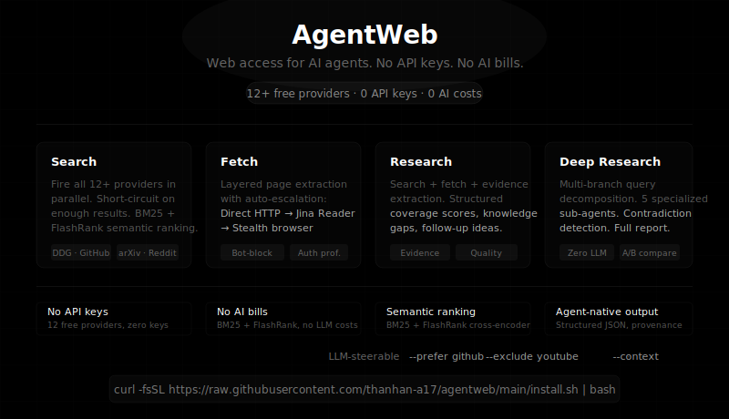

# AgentWeb

**Web access for AI agents. No API keys. No AI bills. No setup.**

Search, fetch, research, and deep-research the web — completely free, no keys required. Uses smart search + semantic ranking, not language models. Predictable, auditable, costs nothing to run.

## ⚡ Quick Install

```bash
curl -fsSL https://raw.githubusercontent.com/thanhan-a17/agentweb/main/install.sh | bash
```

```bash
# verify
agentweb search "Hermes Agent 2026" --format json
```

## One-Click Install (for AI agents)

Paste to Hermes Agent, OpenCode, Codex CLI, etc.:

```
Install AgentWeb. Requirements: Python 3.11+.

1. Check: `which agentweb`
2. Install: `uv tool install 'agentweb[browser,crawl,youtube] @ git+https://github.com/thanhan-a17/agentweb.git'`
3. Verify: `agentweb search "Hermes Agent 2026" --format json` — confirm structured results with titles, URLs, and source labels.
```

Upgrade: `curl -fsSL https://raw.githubusercontent.com/thanhan-a17/agentweb/main/install.sh | bash` or `uv tool upgrade agentweb`.

## Commands

| Command | What it does |
|---|---|
| `search` | Searches across 12+ sources — DDG, arXiv, Wikipedia, Reddit, GitHub, HN, YouTube, and more. All fire in parallel; results ranked by BM25 + FlashRank. |
| `fetch` | Grabs full page content. Tries direct HTTP → trafilatura → Jina Reader → stealth browser. Auto-detects bot-blocks. |
| `research` | Search + fetch + evidence pack with coverage scores, knowledge gaps, follow-up ideas. |
| `deep-research` | Decomposes your question into 5 branches, searches each with per-branch source hints, extracts evidence, detects contradictions, writes structured report. No LLM needed. |

### CLI Flags

| Flag | Applies to | Description |
|---|---|---|
| `--max-results` | search, research, deep-research | Result count (supports ranges e.g. `8-12`) |
| `--max-chars` | fetch, research, deep-research | Max chars per source (supports ranges) |
| `--format` | all | `json` or `markdown` |
| `--output` / `-o` | all | Write to file |
| `--prefer` | search | Prioritize specific providers (e.g. `--prefer github reddit`) |
| `--exclude` | search | Skip providers (e.g. `--exclude youtube arxiv`) |
| `--context` | search, research, deep-research | Context string injected into ranking query |
| `--cookies` | fetch | Cookie string or Netscape cookies.txt path |
| `--browser` | fetch | Try browser snapshot fallback |
| `--refinement-loops` | deep-research | Iterative refinement passes |

```bash
# LLM hints steer the source mix
agentweb search "MCP server implementation" --prefer github --exclude youtube,arxiv

# Deep research auto-generates per-branch source hints
agentweb deep-research "Claude Code vs Cursor features pricing" -o report.md
```

## Python SDK

```python
from agentweb import AgentWeb

aw = AgentWeb()

# Search with provider steering
result = aw.search("latest ML papers", prefer=["github", "arxiv"])
for item in result["results"]:
    print(item["title"], item["url"], item["source"], item["confidence"])

# Fetch with auto-escalation
page = aw.fetch("https://example.com", use_browser=True)

# Research → evidence pack
pack = aw.research("transformer attention mechanisms")
print(pack["coverage_score"], pack["knowledge_gaps"])

# Deep research → structured report
report = aw.deep_research("LoRA fine-tuning best practices 2026")
print(report["report_markdown"][:2000])

# Streaming deep research
for phase in aw.deep_research_stream("quantization methods LLM"):
    print(f"Phase: {phase['phase']}")

# OpenAI-compatible tool schemas
tools = AgentWeb.openai_tools()
```

## Architecture (v0.4.0+)

```
CLI · SDK
  └─ Engine (agentweb/engine/)
       ├─ search.py       — Scatter/gather all providers, short-circuit, rank
       ├─ rank.py         — Two-pass: BM25 (bm25s) + FlashRank + recency + domain diversity
       ├─ fetch.py        — Async layered extraction (trafilatura → Jina → browser)
       └─ providers/      — 12 auto-discovered provider plugins
            ├─ duckduckgo · github · hackernews · stackexchange
            ├─ arxiv · wikipedia · reddit · youtube
            ├─ jina · twitter · nominatim · general
  └─ Deep research (deep_research.py)
       ├─ Query decomposition → 5-branch comparison engine
       ├─ Per-branch source hints (intent → --prefer mapping)
       ├─ BM25 ranking + authority boost + source diversity scoring
       ├─ Evidence extraction → Contradiction detection
       └─ Structured report with audit metadata
  └─ Core wrappers (core.py)
       └─ search_web() · research() · fetch_url() · search_by_provider()
  └─ Auth & Safety
       ├─ Content authenticity scoring — runtime quality assessment
       ├─ Stealth browser — canvas noise, WebGL spoofing, timing jitter
       ├─ InputGuard — input validation, secret redaction
       └─ Auth profiles — persistent browser sessions
```

### Search Pipeline

```
Query + --prefer/--exclude/--context hints
    │
    ▼
┌─ engine/search.py ─────────────────────────────────┐
│ 1. Filter excluded providers                       │
│ 2. Fire ALL providers in parallel (ThreadPool)     │
│ 3. Per-provider max_timeout_s enforced (arXiv 3s) │
│ 4. Short-circuit: ≥2 providers, ≥8 results         │
│ 5. Canonical URL dedup                             │
└──────────┬─────────────────────────────────────────┘
           ▼
┌─ engine/rank.py ───────────────────────────────────┐
│ 1. BM25 first-pass (bm25s, Numba, <10ms)          │
│ 2. FlashRank cross-encoder (ONNX, <100ms)         │
│ 3. Recency weighting (exponential decay)          │
│ 4. Domain diversity (max 2/domain, 30% social cap)│
│ 5. Prefer-boost (+15% for --prefer domains)       │
└──────────┬─────────────────────────────────────────┘
           ▼
    Ranked SearchResult[]
```

### Deep Research: Per-Branch Source Hints

The query planner generates branch intents → each branch auto-generates provider hints:

| Intent | Prefers |
|---|---|
| `direct_comparison` | reddit, hackernews, stackexchange |
| `entity_focused` | github, wikipedia, stackexchange |
| `pros_cons` | reddit, hackernews |
| `background` | wikipedia |
| `current_status` | news, reddit |

## Why

**Built for AI agents, not humans.** Every command returns structured data with quality scores and source info.

- **No API keys.** 12+ free providers — DuckDuckGo, HN, arXiv, Wikipedia, Reddit, GitHub, Jina Reader, YouTube, StackExchange, and more.
- **No AI costs.** No language models used anywhere. Predictable, auditable, $0 to run.
- **Semantic ranking.** BM25 + FlashRank reranking replaces fragile keyword/sector routing. Top results are topically relevant, not "one from each source."
- **LLM-steerable.** `--prefer github` bumps code results. `--exclude youtube` saves latency. `--context` refines ranking intent.
- **Bot-block detection.** CAPTCHAs, Cloudflare challenges, Jina errors — all auto-detected and filtered so agents don't act on garbage.
- **Quality filtering.** Research output filters below score < 3.0. Deep research applies the same gate before evidence extraction.
- **Comparison-aware deep research.** "A vs B" queries get 5 specialized branches and per-branch source hints.

## Design

- **No API keys** — no subscriptions, no AI bills
- **Content quality scoring** — replaces fragile domain allow/block lists
- **Layered extraction** — every fetch tries multiple methods automatically
- **Agent-native output** — JSON with quality scores, provenance, coverage
- **No language models** — predictable, auditable, free
- **Anti-detection** — stealth browser with canvas noise, WebGL spoofing, timing jitter
- **Safety guards** — input validation, secret redaction on all output paths

## License

MIT — see [LICENSE](LICENSE).
